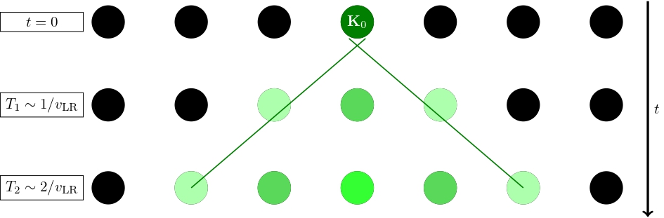

# AdaptMaxEnt
## Adaptive Max-Ent Restricted Evolutions for Local Hamiltonians

This repository contains an implementation for the exploration of different Adaptive Max-Ent Restricted Evolutions for local Hamiltonians.
The code is meant to be the basis for a future and more comprehensive library but at this stage is mainly implemented via Python libraries to be used in Jupyter Notebooks,
a structure suited for exploration of dynamics and development. 
---

## Table of Contents
1. [Introduction](#introduction)
2. [Features](#features)
3. [Built With](#built-with)
4. [Installation](#installation)
5. [Usage](#usage)
6. [Examples](#examples)
7. [Contributing](#contributing)
8. [License](#license)

---

## Introduction

Efficiently simulating quantum many-body systems is a fundamental challenge in quantum physics.  
This project implements a recipe for **adaptive Max-Ent dynamics**, which shares conceptual similarities with Krylov techniques and the time-dependent variational principle. This approach closely follows the exact Schrödinger dynamics while avoiding exploration of the full observable space, ${\cal A}$, providing a numerically exact and stable method. 

The **restricted Max-Ent framework** offers a tractable way to simulate dynamics on a smaller subspace via a (weighted-) linear projection $\pi_{B,\sigma}$ from the full observable space ${\cal A}$ onto a smaller, more manageable subspace ${\cal A}_B$, spanned by a reduced basis. Key objects of interest in this framework include:

1. **Low-Dimensional Basis of Observables $B_{\ell}$**  
   Typically, the basis is constructed to include $\ell$ iterated commutators of the Hamiltonian and a relevant seed operator, such as the initial state $\mathbf{K}_0 = \log(\rho(0))$.

2. **Scalar Product $(\cdot, \cdot)_{\sigma}^{(s)}$**  
   The scalar product can take the form of:
   - **Kubo-Mori-Bogoliubov (KMB)**: Accurate but computationally expensive.  
   - **Covariance Scalar Product**: A robust alternative that tightly bounds the KMB product. This is the one which we will use in these examples. 

3. **Mean-Field Projections**
   Simplify states $\mathbf{K}$ involving costly $n$-body correlations by projecting them into their $m_0$-body components, with $m_0 \ll n$, yielding more tractable states $\mathbf{K}^{\rm (MF)}$.

Despite its advantages, restricted Max-Ent has its limitations, including high computational cost and potential errors if the fixed basis $B$ fails to account for all statistically relevant observables.

### Adaptive Max-Ent
To overcome these challenges, this project introduces **adaptive Max-Ent dynamics**, an autonomous method that updates the geometry (basis and scalar product) and applies mean-field projections during discrete simulation steps. This is particularly effective for **geometrically local Hamiltonians**, as their dynamics are constrained by Lieb-Robinson bounds, which restricted Max-Ent respects by design.


<p align="center">
  
</p>
*Figure 1: Illustration of the Lieb-Robinson bounds, an integral idea of Adaptive Max-Ent simulations for geometrically local Hamiltonians.*


The method adapts by monitoring the error measured via a figure of merit, the $p$-th partial sum ${\cal K}_p$ and updating when it exceeds a given tolerance $\epsilon$. This results in a reliable and efficient framework characterized by several parameters $\ell$, $\epsilon$, $m_0$.

---

## Features
- **Restricted Max-Ent Formalism**: Restricted evolution using Max-Ent projections and Krylov-like expansions, constrained by Lieb-Robinson bounds.
- **Adaptive Max-Ent Formalism**:
  - **Dynamic Basis and Scalar Product Updates**: Automatically update to incorporate the most relevant observables.
  - **Mean-Field Projections**: Simplify objects for computational efficiency.
  - **Customizable Update Criteria**: Explore different criteria based on Max-Ent bounds or Lieb-Robinson bounds.
- **Examples and Tutorials**: Demonstrates the method’s applicability to various quantum many-body dynamics.

---

## Built With

- **Python**: Core programming language.
- **ALPSQuTip**: A library intended to bridge the gap between ALPS condensed matter models and QuTiP calculations.
- **ALPS**: A collection of libraries for solving models in condensed matter physics, focusing on quantum many-body systems.
- **QuTiP**: For quantum computing simulations.
- **NumPy**: Efficient numerical operations.
- **Matplotlib**: Data visualization.
- **SciPy**: Advanced scientific computations.


---

## Installation

To set up the environment for this project:

### 1. Clone the repository:
   ```bash
   git clone https://github.com/your-username/max-ent-evolutions.git
   cd max-ent-evolutions
```

### 2. Install Dependencies

Use `pip` to install the required Python libraries:  
   ```bash
   pip install -r requirements.txt
```

### 3. Set up a Virtual Environment (Optional)

To avoid conflicts with your system Python installation, create and activate a virtual environment:  
  ```bash
  python -m venv venv
  source venv/bin/activate  # On Windows: venv\Scripts\activate
  pip install -r requirements.txt
```

### 4. Exploration

With everything installed, the only steps left are to write your own Adaptive Max-Ent evolutions, see Tutorials
for some examples.

## Usage

In this documentation, we will be interested in a $L=7$ one-dimensional spin-$1/2$ Heisenberg XYZ system, with Hamiltonian

$$
  {\bf H} = -\frac{1}{2}\sum_{j=1}^{L} \bigg(
  J_x \sigma_{j}^{x} \sigma_{j+1}^{x} 
  +J_y \sigma_{j}^{y} \sigma_{j+1}^{y}
  +J_z \sigma_{j}^{z} \sigma_{j+1}^{z}
  \bigg),
$$

where $J_x, J_y, J_z$ are the system's parameters, $\sigma_j^{x,y,z}$ are the standard Pauli operators with support on the $j$-th site of the lattice.
This Hamiltonian, in the tutorials, can be constructed in a simple way by employing the ALPS library and a dictionary of parameters.

From there on, one can define an inital state and start using adaptive Max-Ent evolutions to evolve the system for arbitrarily long-term scales requiring hundreds of 
thousands of actualizations.
## Examples

In Tutorials, a series of tutorials can be found, showcasing different examples and behaviours of interest. 
